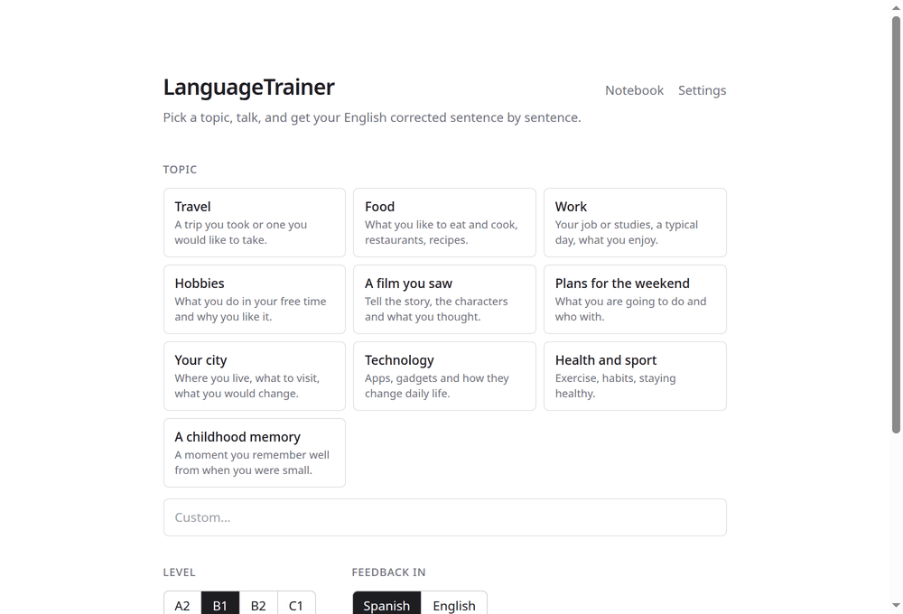

# LanguageTrainer

[](https://github.com/Tatuck/language-trainer/actions/workflows/ci.yml)
[](LICENSE)

Practise **spoken English** in the browser. Pick a topic, talk to a tutor, and every sentence you say comes back colour-coded — natural / could be better / mistake — with a correction, alternative phrasings and notes on the words where your Spanish accent shows most.

**Try it: [tatuck.github.io/language-trainer](https://tatuck.github.io/language-trainer/)** — bring your own [OpenRouter](https://openrouter.ai) key.



## Bring your own key

There is no server. The site is static HTML + JS; your browser talks to OpenRouter directly.

- Your API key is stored in this browser's `localStorage` and sent only to `openrouter.ai`, with each request you make. It never touches any other server.
- Your sessions live in `localStorage` too. Clear site data and they are gone.
- A conversation turn costs a fraction of a cent with the default model; put a spending limit on the key if you want a hard cap.
- Pick any OpenRouter model ids in **Settings**. The audio model must accept audio input (the Gemini models do).

## How it works

1. You press the mic and speak. In Chrome your words appear live (Web Speech API); the browser also records audio and encodes it to 16 kHz mono WAV.
2. On stop, two model calls go out in parallel, straight from the browser:
   - **Analysis** — the audio model gets the WAV plus the analyzer prompt and must answer with a strict JSON `Analysis` (`response_format: json_schema`): transcript, per-sentence verdict (`good` / `improve` / `error`) with `issue`, `correction`, `alternatives`, up to 3 pronunciation notes, and a fluency line. An invalid answer is retried once at higher reasoning effort.
   - **Reply** — the chat model streams a short reply that recasts your mistakes naturally and ends with a question.
3. Sentences render with a solid (good), dotted (improve) or wavy (error) underline; click one for the popover. Typed input works too (no pronunciation notes). "Read aloud" in the session header speaks the tutor's replies (browser `speechSynthesis`).
4. `/notebook` lists every sentence marked *improve* or *error* across all sessions with its correction and alternatives — the long-term review view.

## Run it locally

Needs Node 20+.

```bash
npm install
npm run dev          # http://localhost:3000 → open Settings and paste your key
```

`NEXT_PUBLIC_MOCK_API=1 npm run dev` runs the UI against `fixtures/analysis.json` without a key or any network calls.

The dev server binds to `127.0.0.1`. From another device on your LAN: `npm run dev -- -H 0.0.0.0` (the mic needs HTTPS or `localhost`, so on a phone use a tunnel or an HTTPS proxy).

## Models

| Setting | Default | Notes |
|---|---|---|
| Audio model | `google/gemini-3.8-flash` | Transcription + analysis. Must understand audio; see `docs/decisions.md` for the comparison that picked it. |
| Chat model | `google/gemini-3.8-flash` | Tutor replies. Any OpenRouter model works; audio is forwarded to it only when it is the same model as the audio one, otherwise it gets the text. |

## Browser support

| | Chrome / Edge | Firefox / Safari |
|---|---|---|
| Record + analyse + pronunciation | yes | yes |
| Live text while speaking | yes (Web Speech API, audio goes to Google) | no — text appears after analysis |

## Scripts

```bash
npm test            # vitest
npm run typecheck   # next typegen && tsc
npm run lint
npm run build       # static export to out/
npm run serve       # serve out/ on http://localhost:3001
npm run spike       # compare audio models on fixtures/*.wav (needs OPENROUTER_API_KEY in .env.local)
```

`/dev/recorder` is a dev-only page to hear the encoded WAV and check the live transcript; production builds serve a 404 there.

## Deploying

Every push to `main` runs `.github/workflows/pages.yml`: `next build` with `output: "export"` and `basePath: /language-trainer`, then `actions/deploy-pages`. Any static host works — the build has no server-side code.

## Layout

```
app/page.tsx            topic / level / feedback-language picker, previous sessions
app/s/                  conversation view (SessionView.tsx owns the turn flow; /s?id=…)
app/settings/           API key + model ids, kept in localStorage
app/notebook/           review page over every stored session
components/             Recorder, UserTurn, SentencePopover, BotTurn, Legend, TextInput
lib/schema.ts           Analysis zod schema + strict JSON schema + sentence→span mapping
lib/prompts.ts          analyzer and tutor system prompts
lib/openrouter.ts       OpenAI SDK client pointed at OpenRouter, key check
lib/settings.ts         settings store; lib/use-settings.ts reads it during hydration
lib/llm/                analyze + reply calls, message builders, error mapping
lib/api.ts              what the UI calls: analyze(), streamReply(), mock mode
lib/store.ts            sessions in localStorage; lib/session-normalise.ts settles in-flight state
lib/audio/              WAV encoding, resampling, Web Speech wrapper
lib/tts.ts              speechSynthesis wrapper + preference store
docs/decisions.md       model spike results and architecture notes
```

## License

[MIT](LICENSE)
